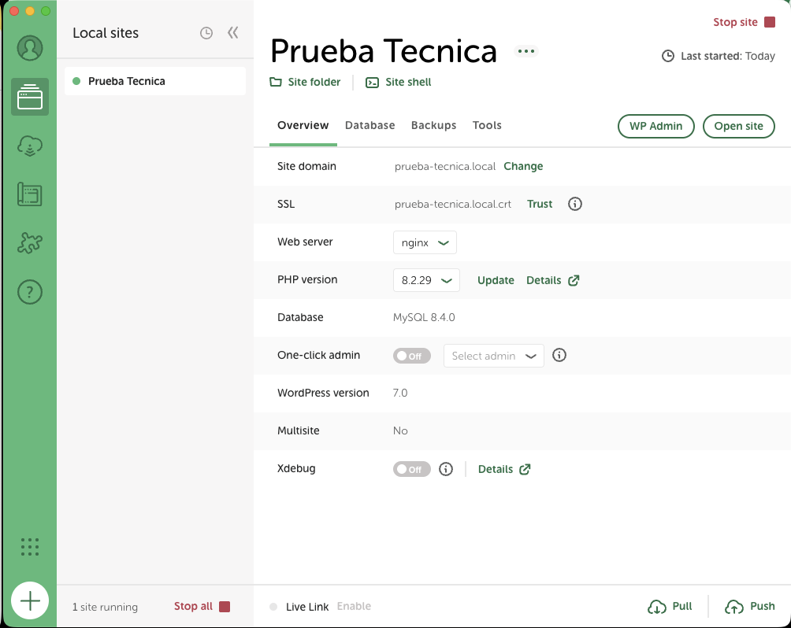
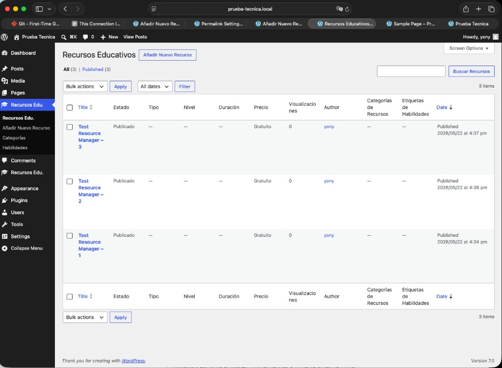
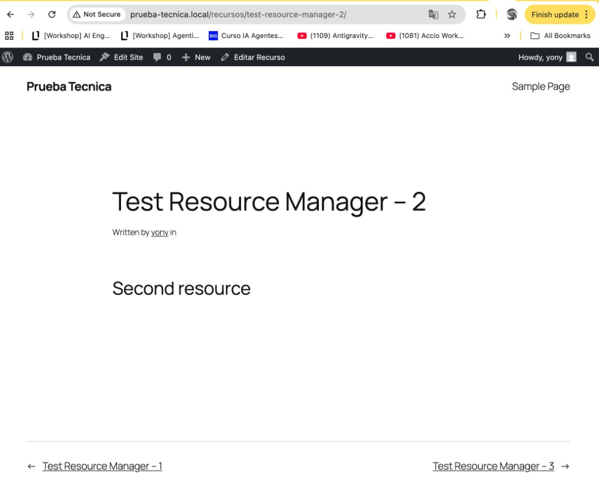

# Education Resources Manager

Plugin de WordPress para gestionar recursos educativos: Custom Post Type, taxonomías, seguimiento de vistas y descargas, REST API, shortcode con filtros y panel de administración con estadísticas.

## Requisitos

- WordPress 6.0 o superior
- PHP 7.4 o superior
- MySQL 5.7+ o MariaDB 10.3+

## Entorno local: [Local](https://localwp.com/) (WordPress)

Este proyecto se desarrolló y se probó con **Local** (Local by Flywheel): entorno WordPress local con un clic para abrir el sitio, el admin y la carpeta del proyecto.



*Archivo: [`docs/screenshots/local-wordpress-site.png`](docs/screenshots/local-wordpress-site.png)*

### Configuración del sitio en Local

| Campo | Valor en la captura |
|-------|---------------------|
| **Nombre del sitio** | Prueba Tecnica |
| **Dominio local** | `prueba-tecnica.local` |
| **Servidor web** | nginx |
| **PHP** | 8.2.29 (el plugin exige ≥ 7.4) |
| **Base de datos** | MySQL 8.4.0 |
| **Multisite** | No |

Desde Local se usan los botones **Open site** (frontend) y **WP Admin** (escritorio). La ruta del plugin en disco es la carpeta del sitio: `app/public/wp-content/plugins/education-resources-manager/`.

Las capturas de pantalla del README (admin, frontend y esta vista de Local) corresponden a ese dominio: `http://prueba-tecnica.local`.

## Instalación

### Vía ZIP (recomendado)

1. Descarga o genera un ZIP de la carpeta `education-resources-manager`.
2. En el escritorio de WordPress, ve a **Plugins → Añadir nuevo → Subir plugin**.
3. Selecciona el archivo ZIP e instala.
4. Activa el plugin **Education Resources Manager**.

### Vía FTP / SFTP

1. Sube la carpeta `education-resources-manager` a `wp-content/plugins/`.
2. En **Plugins**, activa **Education Resources Manager**.

Tras la activación, el plugin registra sus hooks, crea la tabla de tracking y expone CPT, REST API, shortcode y panel de administración.

## Uso del shortcode

Inserta en cualquier entrada, página o plantilla:

```
[recursos_educativos]
```

### Atributos

| Atributo     | Valores                                      | Descripción                          |
|-------------|-----------------------------------------------|--------------------------------------|
| `type`      | `course`, `tutorial`, `ebook`, `video`        | Filtra por tipo de recurso           |
| `difficulty`| `beginner`, `intermediate`, `advanced`        | Filtra por nivel de dificultad       |
| `category`  | slug de `resource_category`                   | Filtra por categoría                 |
| `per_page`  | número entero (por defecto: `10`)             | Recursos por página                  |

### Ejemplos

```
[recursos_educativos type="course" difficulty="beginner"]
[recursos_educativos category="programacion" per_page="6"]
[recursos_educativos type="video" difficulty="advanced" per_page="12"]
```

## Panel de administración (wp-admin)

El plugin añade el menú **Recursos Edu.** en el escritorio de WordPress (`education_resource`) con taxonomías **Categorías** y **Habilidades**, meta boxes al editar y columnas personalizadas en el listado.



*Archivo: [`docs/screenshots/admin-resources-list.png`](docs/screenshots/admin-resources-list.png) — Local: `http://prueba-tecnica.local/wp-admin/edit.php?post_type=education_resource`*

### Menú lateral

| Entrada | Función |
|---------|---------|
| **Recursos Edu.** | Listado de todos los recursos (`edit.php?post_type=education_resource`). |
| **Añadir Nuevo Recurso** | Formulario de alta con meta box «Detalles del Recurso». |
| **Categorías** | Taxonomía jerárquica `resource_category`. |
| **Habilidades** | Taxonomía plana `skill_tag`. |

Desde el mismo menú del plugin también se accede al subpanel **Estadísticas** (página `erm-stats`) con resumen de vistas, descargas y gráficos — ver `ERM_Admin::add_admin_menu()`.

### Columnas del listado

Las columnas extra las registra `ERM_Post_Type::add_custom_columns()` y se rellenan en `render_custom_columns()`:

| Columna | Origen |
|---------|--------|
| **Estado** | `_erm_publication_status` (Borrador / Publicado / Archivado). |
| **Tipo** | `_erm_resource_type` (curso, tutorial, ebook, video). |
| **Nivel** | `_erm_difficulty_level` (beginner, intermediate, advanced). |
| **Duración** | `_erm_duration_minutes` (minutos). |
| **Precio** | `_erm_price` (muestra «Gratuito» si es 0). |
| **Visualizaciones** | Conteo en tabla `{prefix}_erm_tracking` (`action_type = view`). |

En la captura los recursos de prueba aparecen **Publicados** y **Gratuitos**; Tipo, Nivel y Duración están vacíos porque esos posts de demo no tienen meta rellenada — al guardar el recurso desde el meta box se completan.

### Acciones habituales

- **Añadir Nuevo Recurso** — Crear contenido y definir estado de publicación, tipo, URL externa, instructor, etc.
- **Buscar Recursos** — Búsqueda nativa de WordPress sobre el CPT.
- **Filtros** — Por fecha y acciones en lote estándar del listado de posts.

## Vista pública en el frontend (single del CPT)

Además del listado del shortcode `[recursos_educativos]`, cada recurso publicado tiene **URL propia** en el sitio porque el CPT `education_resource` es público y tiene archivo en `/recursos/`.



*Archivo: [`docs/screenshots/frontend-single-resource.png`](docs/screenshots/frontend-single-resource.png)*

*Captura en Local: `http://prueba-tecnica.local/recursos/test-resource-manager-2/`*

### Qué muestra la captura

| Elemento | Significado |
|----------|-------------|
| **URL `/recursos/...`** | Rewrite del CPT (`slug` → `recursos`, ver `ERM_Post_Type::register()`). El segmento final es el slug del post (`test-resource-manager-2`). |
| **Título «Test Resource Manager – 2»** | `post_title` del recurso en WordPress. |
| **«Written by yony in»** | Metadatos del tema (autor); el contenido «Second resource.» es el editor del post. |
| **Barra superior «Editar Recurso»** | Enlace de administración del CPT cuando hay sesión iniciada. |
| **«← Test Resource Manager – 1» / «Test Resource Manager – 3 →»** | Navegación entre entradas del mismo tipo que aporta el tema entre singles consecutivos. |

### Relación con el plugin

- **Shortcode** — Catálogo filtrable en una página (cards, AJAX, tracking de vistas desde el listado).
- **Single en `/recursos/{slug}/`** — Plantilla del tema para leer un recurso como entrada; no pasa por el shortcode, pero usa el mismo CPT y permalinks registrados al activar el plugin.
- **REST** — `GET /wp-json/erm/v1/resources/{id}` devuelve el mismo recurso en JSON (metadatos `_erm_*`, categorías, skills, vistas, etc.) para consumo programático.

Los recursos en **borrador** o **archivados** (`erm_archived`) no aparecen en el shortcode ni en la API pública; en el single del tema solo se ven los que WordPress expone como publicados según `post_status`.

## REST API

Namespace: `erm/v1` — URL base: `/wp-json/erm/v1`

| Método | Ruta                         | Descripción                    |
|--------|------------------------------|--------------------------------|
| GET    | `/resources`                 | Lista recursos con filtros     |
| GET    | `/resources/{id}`            | Detalle de un recurso          |
| POST   | `/resources/{id}/track`      | Registra vista, descarga, etc. |
| GET    | `/stats`                     | Estadísticas agregadas         |

Consulta `docs/API.md` para parámetros, respuestas y ejemplos completos. Ver también `docs/ARCHITECTURE.md` y `docs/DATABASE.md`.

## Desarrollo asistido por IA (entrega)

La prueba técnica permite y valora el uso de agentes de IA. Este proyecto usó **dos herramientas de forma complementaria**: primero **Claude** para planificar y redactar los agentes que luego ejecutaría **Cursor**, apoyado en **skills de WordPress** y revisión contra el enunciado.

### Por qué Claude para el plan y Cursor para el código

Tras probar ambos entornos con el mismo enunciado, **Claude (Claude Code) dio mejores resultados en la fase de planificación**: arquitectura por fases, tabla de dependencias entre agentes, prompts largos y detallados (`AGENT_01` … `AGENT_07`) y el archivo orquestador (`00_MASTER_ORCHESTRATOR.md`). Esa salida se copió a [`.cursor/rules/`](.cursor/rules/) como **instrucciones listas para Cursor**.

**Cursor** se usó después para **implementar** cada agente en el repositorio (PHP, JS, CSS, vistas, `docs/`, SQL), con **Agent/Composer**, las reglas generadas por Claude y los **skills de WordPress** activos en el proyecto. En código y refactors finos, Cursor + skills encajaron mejor con el flujo diario del plugin (hooks, REST, `$wpdb`, assets).

En resumen: **Claude diseñó el “qué” y el “en qué orden”; Cursor construyó el “cómo” en archivos**, con skills WP como guía de calidad.

### Flujo en dos fases

```
Enunciado de la prueba
        │
        ▼
┌───────────────────────┐
│  Fase 1 — Claude Code │  Plan maestro, orquestador, AGENT_01…07
│  (mejor en planificación)│  → PROMPTS/01-plan-con-claude-code/
└───────────┬───────────┘  → .cursor/rules/ + PROMPTS/cursor-rules/
            │
            ▼
┌───────────────────────┐
│  Fase 2 — Cursor      │  Ejecutar cada agente → código del plugin
│  + skills WordPress   │  Auditorías, ajustes, docs, pruebas en Local
└───────────────────────┘
```

### Herramientas

| Herramienta | Rol en este proyecto |
|-------------|----------------------|
| **Claude Code (Claude)** | Crear el **plan multi-agente** y los **prompts** (`AGENT_XX`, orquestador, checklists). Material en [`PROMPTS/01-plan-con-claude-code/`](PROMPTS/01-plan-con-claude-code/). |
| **Cursor** | **Ejecutar** esos agentes fase a fase, generar y revisar código; reglas en `.cursor/rules/` (entrega en [`PROMPTS/cursor-rules/`](PROMPTS/cursor-rules/)). |
| **Skills WordPress (Cursor)** | Durante la Fase 2: REST API, plugin lifecycle, seguridad, rendimiento, etc. (ver tabla más abajo). |
| **Local (Flywheel)** | Entorno local donde se ejecutó y validó el plugin (`prueba-tecnica.local`); ver [Entorno local](#entorno-local-local-wordpress). |

### Prompts y configuración Cursor (incluidos en el repositorio)

**No se omitieron** del control de versiones las carpetas donde reposan todos los prompts y reglas usados para generar este proyecto. Están **incluidas a propósito** en Git; el `.gitignore` **no** las excluye (salvo la excepción indicada abajo).

| Ruta | ¿Versionada? | Contenido |
|------|--------------|-----------|
| [`.cursor/rules/`](.cursor/rules/) | **Sí** | Agentes `AGENT_01` … `AGENT_09`, orquestador (`00_MASTER_ORCHESTRATOR.md`), `PRUEBA_TECNICA.mdc` — reglas activas en Cursor durante la implementación. |
| [`.cursorrules/`](.cursorrules/) | **Sí** | [`CURSORRULES.md`](.cursorrules/CURSORRULES.md) — reglas globales del proyecto para Cursor. |
| [`PROMPTS/`](PROMPTS/) | **Sí** | Copia de entrega de todos los prompts: plan con Claude, `cursor-rules/`, correcciones (`PROMPT_FIX_*`), bonus tests, etc. |

**Única excepción bajo `.cursor/`:** en `.gitignore` solo figura `.cursor/skills/` (skills de WordPress instalados localmente en Cursor, voluminosos y reinstalables). **`.cursor/rules/` sí se sube al repo.**

Lo que **sí** queda fuera de Git por diseño (no son prompts del proyecto): `docs/requerimientos/` (enunciado local de la prueba) y dependencias generadas (`vendor/`, `tests/wp-tests-config.php`).

### Carpeta `PROMPTS/`

Incluye lo pedido en las instrucciones de entrega (*prompts utilizados*):

- Copia versionada de los prompts de implementación (`.cursor/rules` → `PROMPTS/cursor-rules/`).
- Prompt inicial, **salida de Claude (10 archivos)** y material relacionado en `PROMPTS/01-plan-con-claude-code/` (ver `SALIDA-CLAUDE-CODE.md`).
- Reglas globales también en [`.cursorrules/CURSORRULES.md`](.cursorrules/CURSORRULES.md).

Índice completo: [`PROMPTS/README.md`](PROMPTS/README.md).

### Skills de WordPress (Cursor)

En el repositorio local se instalaron **skills de WordPress** bajo `.cursor/skills/` (no se versionan en Git; ver `.gitignore`). Cursor los aplica automáticamente cuando el contexto encaja, para no improvisar APIs obsoletas ni saltarse seguridad o estándares del Plugin Handbook.

| Skill | Cómo ayudó a la calidad del resultado |
|-------|----------------------------------------|
| **`wordpress-router`** | Clasificar el repo como plugin WP y elegir el flujo correcto (REST, BD, admin, docs) antes de codificar. |
| **`wp-plugin-development`** | Estructura del plugin, hooks de activación/desactivación/uninstall, Settings API, sanitización, nonces y ciclo de vida. |
| **`wp-rest-api`** | Diseño de rutas `erm/v1`, `permission_callback`, validación de argumentos, envelope JSON y documentación en `docs/API.md`. |
| **`wp-project-triage`** | Inspección determinística del proyecto (tipo, carpetas, convenciones) para no desviar la entrega. |
| **`wp-performance`** | Criterios para queries con `$wpdb->prepare()`, índices en `erm_tracking`, transients en estadísticas y carga condicional de assets. |
| **`wp-wpcli-and-ops`** | Referencia para pruebas operativas (activar plugin, flush, cron) en entorno local cuando aplica. |
| **`wp-phpstan`** | Orientación de tipado y anotaciones PHP en código orientado a WordPress (cuando se revisó calidad estática). |
| **`wp-plugin-directory-guidelines`** | Checklist de seguridad, GPL y patrones aceptables si se evaluara publicación en el directorio. |

Skills del mismo paquete disponibles pero **poco o no usados** en este plugin (sin bloques Gutenberg ni theme.json): `wp-block-development`, `wp-block-themes`, `wp-interactivity-api`, `wp-playground`, `wp-abilities-api`, `wpds`, `blueprint`.

### Reglas y contexto del enunciado

- **Agentes 01–07** — Alcance acotado por fase, checklist y dependencias (menos omisiones entre CPT, BD, REST y frontend).
- **`PRUEBA_TECNICA.mdc`** — Regla Cursor que apunta a `docs/requerimientos/` (enunciado local, gitignored) para comparar implementación vs requisitos antes de cerrar la entrega.

### Qué aportó esto al resultado final

- **Plan coherente** (Claude): menos saltos de fase y prompts reutilizables en Cursor.
- **Implementación alineada con WordPress** (Cursor + skills): WPCS, prepared statements, `sanitize_*` / `esc_*`, capabilities, REST `erm/v1` coherente con el shortcode AJAX.
- **Documentación y SQL** como entregables de la prueba (`docs/`, `database/schema.sql`).
- **Trazabilidad** para el evaluador: origen del plan en Claude, prompts en `PROMPTS/`, ejecución y skills descritos en este README.

## Tests (bonus PHPUnit)

Suite en `tests/` con **50 tests** (CPT/taxonomías + REST API `erm/v1`).

```bash
composer install
mysql -u root -proot -e "CREATE DATABASE IF NOT EXISTS wordpress_test;"
bash bin/install-wp-tests.sh wordpress_test root root localhost latest
vendor/bin/phpunit
```

En Local (Flywheel), usa las mismas credenciales que `wp-config.php` (`root` / `root`, host `localhost`). Ver comentarios en `tests/bootstrap.php`.

## Desinstalación

1. Desactiva el plugin desde **Plugins**.
2. Pulsa **Eliminar**.

El archivo `uninstall.php` elimina las opciones `erm_version` y `erm_db_version`, la tabla `{prefix}_erm_tracking` y los transients con prefijo `erm_`. **No** borra los posts del tipo `education_resource` (contenido del sitio).

## Changelog

### 1.0.0

- CPT `education_resource`, taxonomías, meta boxes y tabla `erm_tracking`.
- REST API `erm/v1`, shortcode `[recursos_educativos]` con filtros AJAX y panel admin con estadísticas.
- Documentación en `docs/` y scripts SQL en `database/`.
- Plan y agentes creados con Claude Code; implementación en Cursor con skills WordPress (`PROMPTS/` + sección IA en README).
